# GitOps-Homelab

This repository serves as the **Single Source of Truth** for my homelab. Developed over the last eight months as part of my transition into DevOps.

The cluster is managed through **Declarative GitOps** and the **App of Apps pattern**, ensuring the entire infrastructure—from networking to end-user services—is reproducible, version-controlled, and self-healing.

---

## System Architecture

The environment is architected into two logical layers: **Infrastructure Core** (Platform Primitives) and **Application Workloads** (Service Layer).

### Technical Stack

| Layer | Component | Implementation |
| :--- | :--- | :--- |
| **Orchestration** | Runtime | **K3s** (Lightweight Kubernetes) |
| **GitOps** | CD Engine | **ArgoCD** |
| **Networking** | Service Mesh & L2 | **Istio**, **Envoy Gateway**, **MetalLB** |
| **Storage** | Block & S3 | **Longhorn** (CSI), **Garage S3** |
| **Security** | Identity & Secrets | **Authentik** (OIDC), **External Secrets (ESO)**, **Cert-Manager** |
| **Observability** | LGTM Stack | **Loki**, **Grafana**, **Tempo**, **Prometheus** |

Here is a high-level overview of the cluster.

---

## Repository Lifecycle (The Sync Chain)

To manage many different configurations, I'm using a multi-stage **ArgoCD sync chain**. This allows for a "bootstrap-from-zero" workflow where applying a single file triggers the recursive deployment of the entire stack.

1.  **`bootstrap/`**: Contains the `root-app.yaml`. This is the manual entry point.
2.  **`categories/`**: Defines parent "Category Apps" (Infrastructure vs. Applications) that orchestrate the order of operations.
3.  **`argocd-apps/`**: Contains individual `Application` manifests for services like `istio` or `ghost`.
4.  **`charts/`**: The configuration source, containing Helm `values.yaml` overrides, Istio `VirtualServices`, and ESO `SecretStores`.

---

## Service Catalog

### User-Facing Applications
*   **[Ghost](https://ghost.jeremymr.dev/):** My personal blog platform. Engineered with a **MariaDB** backend and **Longhorn** for persistent volume management.
*   **[Kleff](https://kleff.io):** A microservice architecture based PaaS (Vercel alternative). This serves as the testing ground for **Istio service mesh** traffic shifting and **distributed tracing with Tempo**.
*   **Obsidian Vault Sync:** A **CouchDB** NoSQL cluster configured for cross-device synchronization of my Obsidian knowledge base.

### Infrastructure Services
*   **Garage S3:** Self-hosted, distributed S3 storage. Acts as the primary backup target for Longhorn snapshots and the long-term storage backend for Loki logs.
*   **External Secrets (ESO):** Decouples secret management from Git. ESO dynamically pulls credentials from an encrypted provider and injects them as native K8s secrets at runtime.
*   **Identity Management:** **Authentik** serves as the cluster's OIDC provider, enforcing unified SSO across internal administrative dashboards.

---

## Observability & Reliability

A comprehensive observability stack built on the **LGTM** (Loki, Grafana, Tempo, Prometheus) framework with **OpenTelemetry** as the unified telemetry pipeline.

### Architecture Overview

### Telemetry Pipeline

| Component | Role | Configuration Highlights |
| :--- | :--- | :--- |
| **OpenTelemetry Collector** | Unified telemetry ingestion | DaemonSet mode, OTLP (gRPC/HTTP), K8s attributes enrichment, batch processing |
| **Prometheus** | Metrics collection | Kube-Prometheus Stack with Alertmanager, ServiceMonitor CRDs |
| **Loki** | Log aggregation | TSDB schema v13, S3 backend (Garage), OTLP ingestion via gateway |
| **Tempo** | Distributed tracing | Backend for OpenTelemetry traces, gRPC receiver |
| **Blackbox Exporter** | Endpoint probing | HTTP probes for external services (ArgoCD, Kleff) |
| **Grafana** | Unified visualization | Single pane of glass for metrics, logs, and traces |

### Data Flow

1. **Metrics** — Prometheus scrapes metrics from K8s components, Envoy proxies, and Kleff microservices via `ServiceMonitor` CRDs
2. **Logs** — OpenTelemetry Collector reads from `/var/log/pods`, enriches with K8s metadata, and pushes to Loki via OTLP
3. **Traces** — Kleff microservices auto-instrumented with Java agent emit spans to Otel Collector → Tempo
4. **Storage** — Loki persists log chunks to Garage S3 for cost-effective, durable long-term storage
5. **Visualization** — Grafana queries all three backends (Prometheus, Loki, Tempo) for correlated observability

### Key Features

- **Zero-Code Instrumentation:** Java microservices automatically instrumented via OpenTelemetry Operator's `Instrumentation` CRD
- **S3-Backed Storage:** Loki uses Garage S3 for scalable, cost-effective log retention
- **Uptime Monitoring:** Blackbox Exporter probes external endpoints and exposes availability metrics to Prometheus
- **Correlated Debugging:** Trace IDs from Tempo can be cross-referenced with logs in Loki through Grafana's Explore view
- **Data Durability:** Automated volume backups are replicated to off-site S3 storage via Longhorn's recurring job system

---
*Maintained by [Jeremy Misola](http://github.com/jeremy-misola) — DevOps Engineer & Platform Enthusiast.*

---
