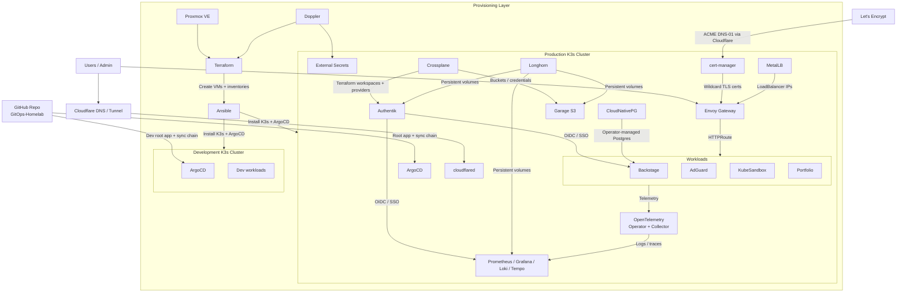

# GitOps-Homelab

This repository is the single source of truth for my homelab platform. It provisions the underlying virtual machines on Proxmox, bootstraps K3s with Ansible, and continuously reconciles platform services and workloads through ArgoCD.

The current architecture is split across two Kubernetes environments:

- `prod-k3s`: the primary highly available cluster for shared platform services and user-facing apps
- `dev-k3s`: a smaller development cluster for testing changes before they graduate to production

---

## Architecture

The homelab now has three layers: infrastructure provisioning, Kubernetes platform services, and application workloads.

### Provisioning Layer

| Area | Implementation | Notes |
| :--- | :--- | :--- |
| Virtualization | Proxmox VE | Hosts every control plane and worker VM |
| Infrastructure as Code | Terraform | Creates the `prod` and `dev` VM fleets and generates per-cluster inventories |
| Bootstrap | Ansible | Installs K3s, disables bundled networking/storage defaults, and bootstraps ArgoCD |
| Secrets for Provisioning | Doppler | Supplies Proxmox API credentials and K3s bootstrap tokens |

### Kubernetes Platform

| Domain | Components |
| :--- | :--- |
| Runtime | K3s |
| GitOps | ArgoCD |
| Networking | MetalLB, Envoy Gateway, cloudflared |
| PKI | cert-manager with Cloudflare DNS-01 |
| Identity | Authentik |
| Secrets | External Secrets Operator |
| Storage | Longhorn, Garage S3 |
| Data Platforms | CloudNativePG |
| Platform Automation | Crossplane with Terraform, Helm, and Kubernetes providers |
| Observability | kube-prometheus-stack, Grafana, Loki, Tempo, OpenTelemetry, blackbox-exporter |

### Cluster Topology

| Cluster | Topology | Purpose |
| :--- | :--- | :--- |
| `prod-k3s` | 3 control planes, 3 workers | Production platform services, ingress, storage, observability, and user-facing apps |
| `dev-k3s` | 1 control plane, 2 workers | Lower-cost validation environment for platform and app changes |

---

## GitOps Lifecycle

The cluster is reconciled through a Helm-generated ArgoCD sync chain.

1. `bootstrap/root-app-dev.yaml` and `bootstrap/root-app-prod.yaml` are the manual entry points for each cluster.
2. `operators-helm/values/values-dev.yaml` and `operators-helm/values/values-prd.yaml` define the environment, target Git revision, enabled operators, and sync waves.
3. `operators-helm/templates/` renders ArgoCD `Application` resources for Helm releases plus any pre-install and post-install manifests.
4. `operators-helm/operators/` contains per-service chart values and the raw Kubernetes resources that surround each chart.
5. ArgoCD continuously self-heals the cluster back to the state declared in Git.

This ordering keeps foundational services such as secrets, storage, ingress, and certificates ahead of dependent workloads.

---

## Workloads

### Platform Services

- `Authentik` provides OIDC and shared SSO for internal dashboards.
- `Backstage` acts as the internal developer portal and service catalog.
- `AdGuard Home` provides network-level DNS filtering.
- `Garage S3` backs object storage use cases such as Loki retention and backup targets.
- `CloudNativePG` supplies operator-managed PostgreSQL for stateful services.

### Applications

- `KubeSandbox` is a multi-service workload deployed as separate frontend and backend charts.
- `Portfolio` is a custom application deployed with its own service, route, secrets, and database resources.
- `dev-k3s` is reserved for validating platform and application changes before promoting them to `prod-k3s`.

---

## Observability

The platform uses an OpenTelemetry-first LGTM stack:

- `kube-prometheus-stack` scrapes Kubernetes, cluster services, and blackbox probes.
- `OpenTelemetry Operator` provides Java auto-instrumentation for supported workloads.
- `OpenTelemetry Collector` receives and enriches telemetry before forwarding it downstream.
- `Loki` stores logs with Garage S3 as the object storage backend.
- `Tempo` stores traces for distributed request visibility.
- `Grafana` ties metrics, logs, and traces together for correlation and troubleshooting.

Telemetry flow is straightforward: workloads and platform services emit signals to the collector, Prometheus scrapes metrics directly, and Grafana becomes the shared entry point for debugging across the stack.

---

## Repository Map

| Path | Purpose |
| :--- | :--- |
| `bootstrap/` | Root ArgoCD applications per environment |
| `operators-helm/` | Helm-templated ArgoCD application factory and operator definitions |
| `provisioning/terraform/` | Proxmox VM provisioning and generated inventories |
| `provisioning/ansible/` | K3s bootstrap automation |
| `docs/backstage/catalog/` | Backstage software catalog entities |
| `docs/code/` | Mermaid source diagrams |
| `scripts/` | Utility playbooks and maintenance helpers |

---

*Maintained by [Jeremy Misola](https://github.com/jeremy-misola).*
